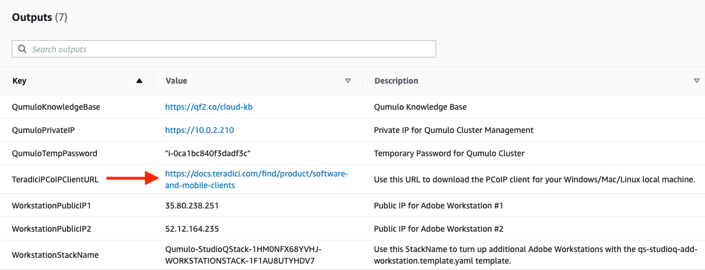

// Add steps as necessary for accessing the software, post-configuration, and testing. Don’t include full usage instructions for your software, but add links to your product documentation for that information.
//Should any sections not be applicable, remove them

== Test the deployment
// If steps are required to test the deployment, add them here. If not, remove the heading

. If you don't already have the Teradici client installed, check the *Outputs* section of the main stack and navigate to the TeradiciPCoIPClientURL.

[#test1]
.Teradici PCoIP Client download URL

[start=2]
. Download and install the Teradici client.
. Check the *Outputs* section of the workstation stack and copy the value for GFXWorkstationHostname.

[#test2]
.Workstation host address
image::../images/image2.png[Architecture,width=100%,height=100%]

[start=4]
. Launch the Teradici client and paste the GFXWorkstationHostname value into the *hostname* field.

[#test3]
.Teradici PCoIP client
image::../images/image3.png[Architecture,width=100%,height=100%]

[start=5]
. Click *Next*. If prompted with a certificate warning, select *Connect Insecurely*

[#test4]
.Certificate warning
image::../images/image4.png[Architecture,width=50%,height=50%]

[start=6]
. Enter the credentials selected when launching the Quick Start and click *LOGIN*.

[#test5]
.Teradici login

[start=7]
. If you entered one of the temporary user credentials, you should be brought to a Windows login screen. Use the *Connection* menu to send CTRL + ALT + DEL.

[#test6]
.Workstation welcome screen
image::../images/image7.png[Architecture,width=100%,height=100%]

[start=8]
. If this is your first time logging in you will be asked to change your password.

[#test7]
.Password reset warning

[start=9]
. After logging into the workstation, open File Explorer and verify that the Q: drive has been mapped.

[#test8]
.Q: drive mapped
image::../images/image9.png[Architecture,width=100%,height=100%]
