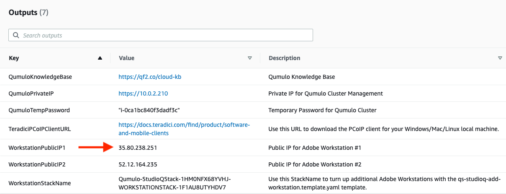
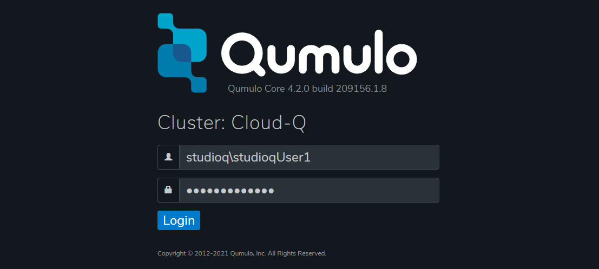
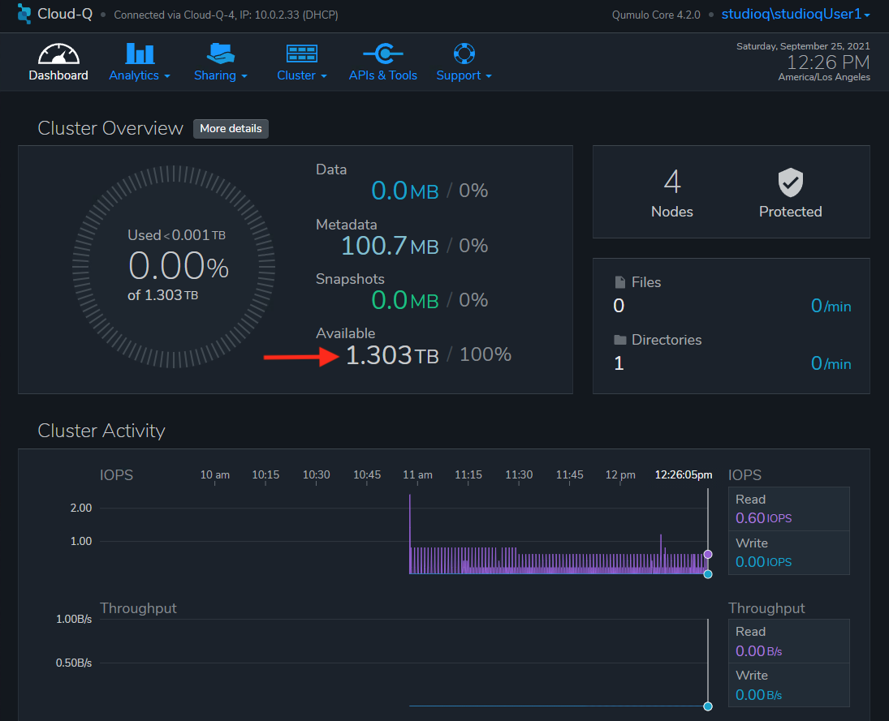
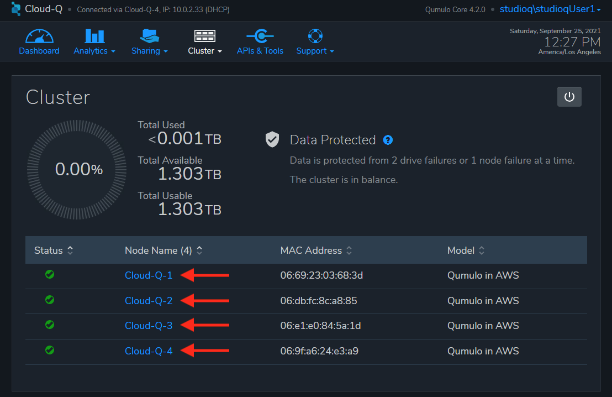

// Add steps as necessary for accessing the software, post-configuration, and testing. Don’t include full usage instructions for your software, but add links to your product documentation for that information.
//Should any sections not be applicable, remove them

== Test the deployment
// If steps are required to test the deployment, add them here. If not, remove the heading

[start=1]
. If you haven't already installed the Teradici client, check the *Outputs* section of the main stack and navigate to the URL beside the TeradiciPCoIPClientURL key.

[#test1]
.Teradici PCoIP client download URL
image::../images/image1.png[Architecture]

[start=2]
. Download and install the Teradici thin client for your local Windows/Mac/Linux machine.
. Check the *Outputs* section of the main stack and copy the value for the WorkstationPublicIP1 key.

[#test2]
.Workstation host address

[start=4]
. Launch the Teradici client and paste the WorkstationPublicIP1 value into the *hostname* field. Optionally provide a name in the *Connection Name* field to create a shortcut when launching the Teradici client.

[#test3]
.Teradici PCoIP client
image::../images/image3.png[Architecture]

[start=5]
. Choose *Next*. If prompted with a certificate warning, select *Connect Insecurely*. To replace the self-signed certificate, see https://www.teradici.com/web-help/pcoip_connection_manager_security_gateway/19.08/security/creating_cmsg_cert/[Creating, Installing, and Managing Certificates^] on the Teradici website.

[#test4]
.Certificate warning
image::../images/image4.png[Architecture,width=25%,height=25%]

[start=6]
. Check to see if the Teradici client recognizes the Active Directory domain name entered in the template.  Workstations take about 10 minutes to boot and configure about completing the template. If the domain name is not found, close the Teradici window and repeat steps 3 and 4.

[#test5]
.Teradici login with valid Active Directory domain
image::../images/image5.png[Architecture]

[start=7]
. Enter the Active Directory accounts base user name and the number of the workstation that you want to connect to. Use the default password for Active Directory accounts that you entered when launching the Quick Start, and choose *LOGIN*.

[#test6]
.Teradici login user name and default password

[start=8]
. If you entered one of the temporary user credentials, a Windows login screen will appear. Use the *Connection* menu to choose CTRL + ALT + DELETE. Note: If using a Mac, the *Connection* menu is in the menu bar at the top of the screen.

[#test7]
.Workstation welcome screen
image::../images/image7.png[Architecture]

[start=9]
. If logging in for the first time, you are prompted to enter your credentials again and change your password.

[#test8]
.Password reset warning
image::../images/image8.png[Architecture]

[start=10]
. After logging in to the workstation, the {partner-product-short-name} desktop appears.

[#test9]
.Studio Q Desktop
image::../images/desktop.png[Architecture]

[start=11]
. Open File Explorer and verify that the Q drive has been mapped.

[#test10]
.Q: Drive mapped to Qumulo
image::../images/image9.png[Architecture]

[start=12]
. Open the Windows launch view and choose *Server Manager*.

[#test11]
.Windows Launch View
image::../images/windows.png[Architecture]

[start=13]
. Choose *Local Server*, and verify that Windows Defender Antivirus has a *Windows Real-time Protection: Off* status. 

[#test12]
.Windows Server Manager
image::../images/server_manager.png[Architecture]

[#test13]
.Windows Local Server
image::../images/local_server.png[Architecture]

== Post-deployment steps

=== Set the default browser

[start=1]
. Go to the upper-right corner of the Chrome browser and choose *Settings > Default browser*, and choose Chrome as the default browser. Close the *Settings* window.

[#test13]
.Chrome settings
image::../images/chrome_settings.png[Architecture]

.Chrome default browser
image::../images/chrome_default.png[Architecture]

.Chrome make default
image::../images/chrome_make.png[Architecture]

.Chrome select as default browser
image::../images/chrome_select.png[Architecture]

=== Log in to the Qumulo dashboard

[start=1]
. Open the *Qumulo-UI* desktop icon and accept the self-signed certificate by choosing *Advanced* and then proceeding to the site. If you want to replace the self-signed certificate, see https://care.qumulo.com/hc/en-us/articles/115015388507-SSL-Install-a-Signed-SSL-Certificate[Install a Signed SSL Certificate^] from Qumulo.

[#test14]
.Qumulo self-signed certificate
image::../images/qumulo_cert.png[Architecture]

[start=2]
. Enter your Active Directory base account name and the default password. The user name for this login is not appended with a number. Note that this is not an Active Directory login, but a user that has been created with the same Active Directory default credentials and given read-only privileges to view all settings and activity on the cluster. 

[#test15]
.Qumulo UI login

[start=3]
. The Qumulo dashboard displays either 1.3 TB or 12.6 TB usable capacity, depending on your configuration when the template is launched.

[#test16]
.Qumulo dashboard

[start=4]
. Choose *Cluster*. Four nodes are displayed numbered 1 through 4. These are each of your EC2 instances.

[#test17]
.Qumulo Cluster Overview

[start=5]
. In the same window, choose any one of the four nodes. The drive details should show all drives as healthy. The drives are the EBS volumes connected to the specific node (EC2 instance) that you selected.

[#test18]
.Qumulo cluster node 1 details
image::../images/qumulo_ebs.png[Architecture]

[start=6]
. Choose *Cluster > Network Configuration*. The *Search Domains* shows your fully qualified domain name (FQDN). Each of the four nodes shows a persistent IP address (EC2 primary IP address) and three floating IP addresses (EC2 secondary IP addresses) for IP failover.

[#test19]
.Qumulo network configuration

[start=7]
. Choose *Cluster > Active Directory*. At the top of the window, you can confirm that the cluster with the name you gave it has joined the FQDN of your domain.

[#test20]
.Qumulo Active Directory
image::../images/qumulo_ad.png[Architecture]

[start=8]
. Choose *Cluster > SMB Shares*. Note how the *adobe-projects* share has been created. Use this share for all video content and subsequent editing in Adobe Premiere Pro.

[#test21]
.Qumulo SMB shares
image::../images/qumulo_smb.png[Architecture]

[start=9]
. Now, all of the {partner-product-short-name} infrastructure is set up and confirmed to be properly configured. You can move content on to the Qumulo cluster using the *S3 Browser* link on the desktop or any other preferred S3 utility and simply drop the content in the Q drive. All workstations and users now have access to the Q drive. Also, if you create multiple workstations, you can log in to those workstations using the credentials created in this first Teradici session. Any user can log in to any workstation because they are authenticated with Active Directory. 20 users are created by default (for example, studioqUser1, studioqUser2,...studioqUser20). At first login, users must change their password.

== Add another workstation 

The initial deployment deploys 1-10 workstations. If you want to add another workstation, follow these steps:

[start=1]
. Launch the following template:

http://qs_launch_permalink[Deploy additional {partner-product-short-name} workstation^] (https://github.com/aws-quickstart/quickstart-qumulo-studio-q/blob/main/templates/qs-studioq-add-workstation.cft.yaml[View template^])

[start=2]
. From the original, top-level stack, copy the *WorkstationStackName* key value.

.Stack outputs
image::../images/stackname.png[Architecture]

[start=3]
. Paste the stack name in to the *Add Workstation* template, fill in the fields, and launch the template.

.Add Workstation template input
image::../images/add_workstation.png[Architecture]

[start=4]
. When the stack completes, go to the top level for the new stack and choose *Outputs* to see the public IP address for the new workstation. The new workstation has the same configuration as the original workstations that were created.

.Add Workstation template outputs
image::../images/add_workstation_outputs.png[Architecture]

== Upgrade the Qumulo cluster

Qumulo releases software every two weeks in an agile development fashion. The upgrade process takes only a few minutes and should not impact service.  

[start=1]
. Copy the temporary administrator password from the original stack's top-level outputs.

.Add Workstation template outputs
image::../images/qumulo_temp_pwd.png[Architecture]

[start=2]
. Log in to the Qumulo cluster as *admin* using the copied password.

.Admin Login
image::../images/qumulo_admin_login.png[Architecture]

[start=3]
. In Qumulo-UI, choose *Support > Software Upgrade* and then *Qumulo Care*. For more information about Qumulo upgrades, see https://care.qumulo.com/hc/en-us/articles/115007247168-Qumulo-Core-Upgrades-via-UI[Qumulo Core Upgrades via UI^]

.Get the latest upgrade

[start=4]
. Copy the downloaded .qimg file to any SMB share on the cluster. This example uses the adobe-projects share.

.Qumulo upgrade file copied to adobe-projects
image::../images/upgrade_file.png[Architecture]

[start=5]
. Back in Qumulo-UI, choose *Support > Software Upgrade* and enter the path to the file. Then choose *Upgrade* and confirm to continue. The upgrade takes a few minutes.

.Qumulo upgrade file specified
image::../images/qumulo_upgrade_path.png[Architecture]

[start=6]
. When the upgrade is completed, log back in to the Qumulo cluster and confirm that the new version is installed.

.Qumulo upgraded
image::../images/qumulo_upgraded.png[Architecture]

== Upgrading the sidecar Lambda functions
The final step in the upgrade is to update the Python code in the sidecar Lambda functions. This insures that CloudWatch metrics and EBS volume monitoring are in sync with the latest Qumulo Core software on the cluster.

[start=1]
. In the AWS Console, navigate to CloudFormation and select the original top-level stack for the deployment.  Then select *Update*.

.Update original stack
image::../images/sidecar_update.png[Architecture]

[start=2]
. Keep the default *Use current template*.

.Use current template for the stack update

[start=3]
. The template that you originally filled out is displayed. Scroll to the *Qumulo CloudWatch Metrics & Monitoring Configuration* section and change the *Qumulo Sidecar Template URL* version number in the path to match the version on the Qumulo cluster.

.Use current template for the stack update
image::../images/sidecar_update_version.png[Architecture]

[start=4]
. The top-level stack displays *UPDATE_COMPLETE* in the *Stacks* and *Events* lists. 
