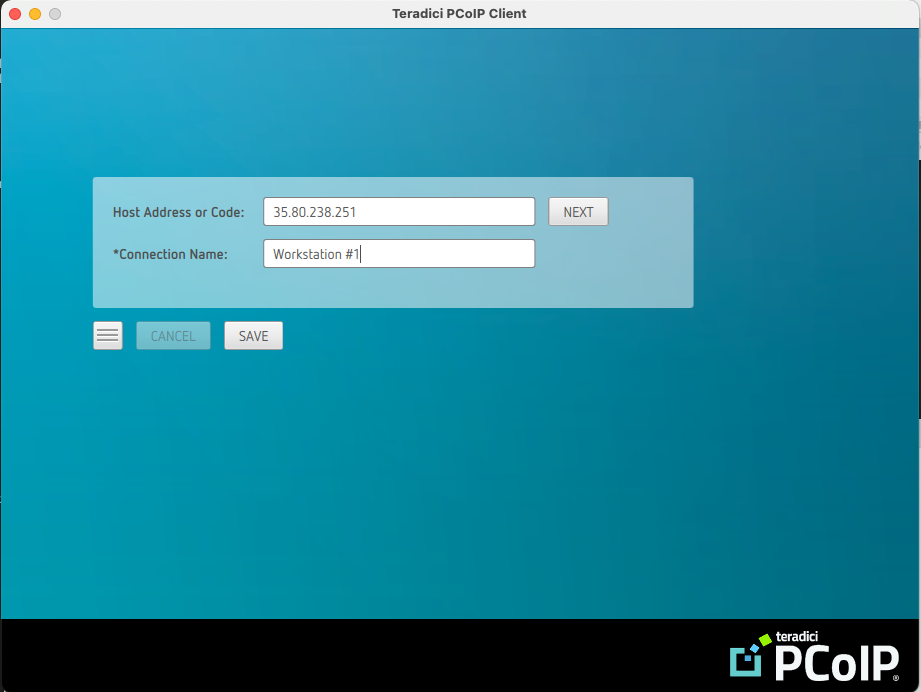
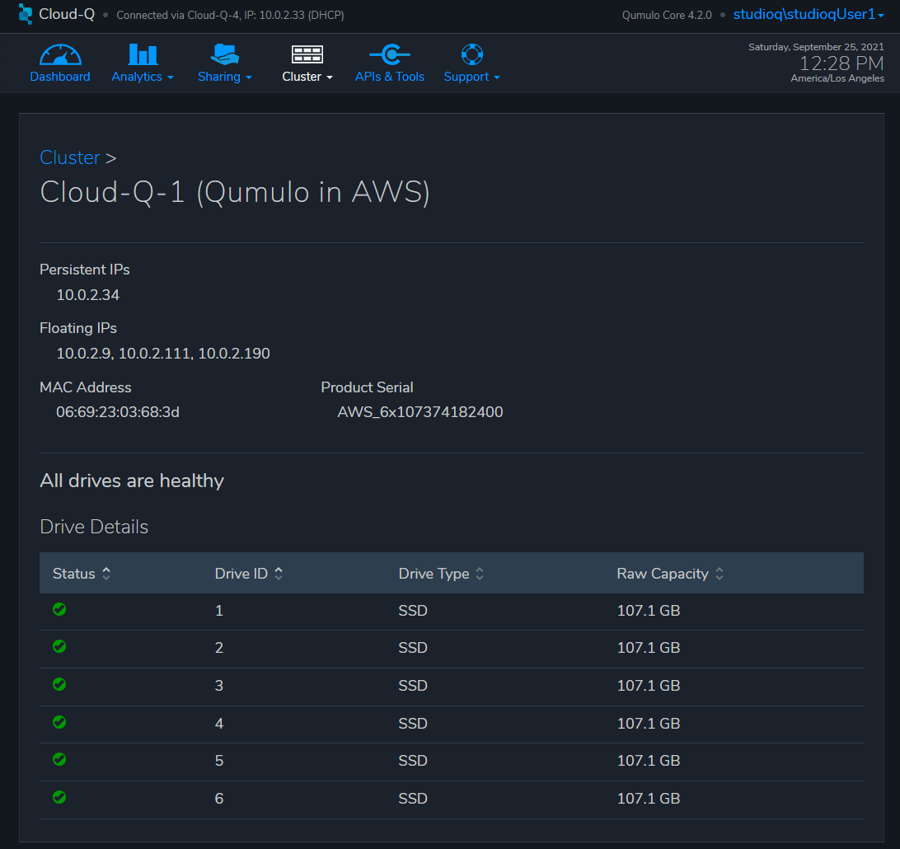
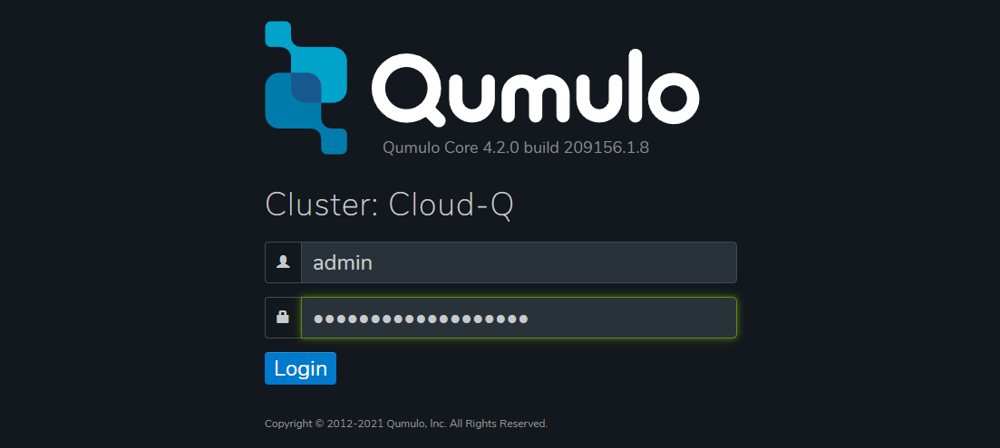

// Add steps as necessary for accessing the software, post-configuration, and testing. Don’t include full usage instructions for your software, but add links to your product documentation for that information.
//Should any sections not be applicable, remove them

== Test the deployment
// If steps are required to test the deployment, add them here. If not, remove the heading

. If you don't already have the Teradici client installed, check the *Outputs* section of the main stack and navigate to the TeradiciPCoIPClientURL.

[#test1]
.Teradici PCoIP Client download URL
image::../images/image1.png[Architecture,width=100%,height=100%]

[start=2]
. Download and install the Teradici thin client for your local Windows/Mac/Linux machine.
. Check the *Outputs* section of the main stack and copy the value for WorkstationPublicIP1.

[#test2]
.Workstation host address
image::../images/image2.png[Architecture,width=100%,height=100%]

[start=3]
. Launch the Teradici client and paste the WorkstationPublicIP1 value into the *hostname* field. The *Connection Name* is optional but if entered and *SAVE*d the public IP will be stored with a shortcut on subsequent Teradici client launches.

[#test3]
.Teradici PCoIP client

[start=4]
. Click *Next*. If prompted with a certificate warning, select *Connect Insecurely*. To replace the self-signed certificate see https://www.teradici.com/web-help/pcoip_connection_manager_security_gateway/19.08/security/creating_cmsg_cert/[Creating, Installing, and Managing Certificates^] from Teradici.

[#test4]
.Certificate warning

[start=5]
. Check to see if the Teradici Client recognizes the Active Directory Domain Name entered in the template.  Workstations take ~10 minutes to boot and configure from template completion. If the domain name is not present close the Teradici window and repeat steps 3 and 4.

[#test5]
.Teradici login with valid AD Domain
image::../images/image5.png[Architecture,width=100%,height=100%]

[start=6]
. Enter the Active Directory Accounts Base Username plus the number of the workstation to connect to, and the default password for AD accounts that were entered when launching the Quick Start and click *LOGIN*.

[#test6]
.Teradici login user name and default password
image::../images/image6.png[Architecture,width=1000%,height=100%]

[start=7]
. If you entered one of the temporary user credentials, you should be brought to a Windows login screen. Use the *Connection* menu to send CTRL + ALT + DEL.

[#test7]
.Workstation welcome screen
image::../images/image7.png[Architecture,width=100%,height=100%]

[start=8]
. If this is your first time logging in you will be asked to enter your credentials again and then prompted to change your password.

[#test8]
.Password reset warning
image::../images/image8.png[Architecture,width=100%,height=100%]

[start=9]
. After logging into the workstation, you will see the following desktop.

[#test9]
.Studio Q Desktop
image::../images/desktop.png[Architecture,width=100%,height=100%]

[start=10]
. Open File Explorer and verify that the Q: drive has been mapped.

[#test10]
.Q: Drive mapped to Qumulo
image::../images/image9.png[Architecture,width=500%,height=500%]

[start=11]
. Now open the Windows launch view and select Server Manager.

[#test11]
.Windows Launch View
image::../images/windows.png[Architecture,width=50%,height=50%]

[start=12]
. Select *Local Server*, and then verify that Windows Defender Antivirus has the status *Windows Real-time Protection: Off*

[#test12]
.Windows Server Manager

.Windows Local Server
image::../images/local_server.png[Architecture,width=100%,height=100%]

[start=13]
. Now go to the upper right corner of the Chrome Browser and select settings, default browser, make default, and finally select Chrome as the default browser.  Close the settings window.

[#test13]
.Chrome Settings
image::../images/chrome_settings.png[Architecture,width=100%,height=100%]

.Chrome Default Browser
image::../images/chrome_default.png[Architecture,width=100%,height=100%]

.Chrome Make Default

.Chrome Select as Default Browser
image::../images/chrome_select.png[Architecture,width=100%,height=100%]

[start=14]
. Now click on the link on the desktop to the *Qumulo UI* and accept the self-signed certificate by clicking *Advanced* and then *Proceed to ...*.  If you want to replace the self-signed certificate see https://care.qumulo.com/hc/en-us/articles/115015388507-SSL-Install-a-Signed-SSL-Certificate[Install a Signed SSL Certificate^] from Qumulo.

[#test14]
.Qumulo Self-Signed Cert

[start=15]
. This is not an AD login but a user has been created with the same AD default credentials and given read-only priveleges to view all settings and activity on the cluster.  Enter your Active Directory Base Account Name and the default password.  Note, no number is appended to the user name for this login.

[#test15]
.Qumulo UI Login
image::../images/qumulo_login.png[Architecture,width=100%,height=100%]

[start=16]
. You will now see the Qumulo Dashboard.  It will display either 1.3TB usable or 12TB usable depending on your chosen configuration at template launch.

[#test16]
.Qumulo Dashboard
image::../images/qumulo_dashboard.png[Architecture,width=100%,height=100%]

[start=17]
. Select *Cluster*.  Four nodes will be displayed numbered 1 through 4.  These are each of your EC2 instances.

[#test17]
.Qumulo Cluster Overview
image::../images/qumulo_cluster.png[Architecture,width=100%,height=100%]

[start=18]
. In the same window click in to any one of the four nodes.  The Drive details should show all drives as healthy.  The drives are the EBS volumes connected to the specific node (EC2 instance) you selected.

[#test18]
.Qumulo Cluster Node 1 Details

[start=19]
. Select *Cluster -> Network Configuration*.  The *Search Domains* should show your FQDN.  Each of the 4 nodes will show a persistent IP (EC2 Primary IP) and three floating IPs (EC2 Secondary IPs) for IP failover.

[#test19]
.Qumulo Network Configuration
image::../images/qumulo_network.png[Architecture,width=100%,height=100%]

[start=20]
. Select *Cluster -> Active Directory*.  At the top of the window you should see that the Cluster with the name you gave it has joined the FQDN of your domain

[#test20]
.Qumulo Active Directory
image::../images/qumulo_ad.png[Architecture,width=100%,height=100%]

[start=21]
. Select *Cluster -> SMB Shares*.  Here you will see the share *adobe-projects* has been created.  Use this share for all video content and subsequent editing in Adobe Premiere Pro.

[#test21]
.Qumulo SMB Shares
image::../images/qumulo_smb.png[Architecture,width=100%,height=100%]

[start=21]
. At this point all of the Studio Q infrastructure is setup and confirmed to be properly configured.  You may move content on to the Qumulo cluster using the *S3 Browser* link on the desktop or any other preferred S3 utility and simply drop the content in the Q:\ drive.  All workstations and all users will have access to the Q:\ drive.  Further, if you chose to create multiple workstations you may login to those using the credentials established in this first Teradici session.  Any user can login to any workstation because they are authenticated with AD.  There are 20 users created by default, e.g. studioqUser1, studioqUser2, ... studioqUser20.  At first login every user will need to change their password.

== Adding Another Workstation after Initial Deployment

In the initial deployment 1 to 10 workstations may be deployed.  If another workstation is desired follow the procedure below:

[start=1]
. Launch the following template
[cols="3,1"]
|===
^|http://qs_launch_permalink[Deploy {partner-product-short-name} additional Workstation^]
^|http://qs_template_permalink[View template^]
|===

[start=2]
. From the original top-level stack copy the *WorkstationStackName*

.Workstation Stack Name - Original Template - Top-level outputs

[start=3]
. Paste the Stack Name into the Add Workstation template, fill in the additional fields, and launch the template.

.Add Worstation Template Input
image::../images/add_workstation.png[Architecture,width=100%,height=100%]

[start=4]
. When the stack completes go to the top-level for the new stack and select outputs to see the Public IP Address for the new workstation.  It will have the exact configuration of the original workstation(s) that were created.

.Add Worstation Template Outputs

== Upgrading The Qumulo Cluster

Qumulo releases software every two weeks in an agile development fashion.  

[start=1]
. To upgrade the cluster first copy the temporary admin password from the original stack top-level outputs.

.Add Worstation Template Outputs

[start=2]
. Login to the Qumulo cluster as *admin* using the copied password

.Admin Login

[start=3]
. In the Qumulo UI select *Support -> Software Upgrade* and then the link *Qumulo Care*.  For more information on Qumulo upgrades see https://care.qumulo.com/hc/en-us/articles/115007247168-Qumulo-Core-Upgrades-via-UI[Qumulo Core Upgrades via UI^]

.Get the Latest Upgrade
image::../images/qumulo_get_upgrade.png[Architecture,width=100%,height=100%]

[start=4]
. Copy the downloaded .qimg file to any SMB share on the cluster.  adobe-projects will be used in this example

.Qumulo Upgrade File Copied to adobe-projects

[start=5]
. Now go back to the Qumulo UI *Support -> Software Upgrade* and enter the path to the file.  Then select *Upgrade* and confirm to continue.  The upgrade will take a couple minutes.

.Qumulo Upgrade File Specified
image::../images/qumulo_upgrade_path.png[Architecture,width=100%,height=100%]

[start=6]
. When the upgrade is complete log back in to the Qumulo cluster and confirm the new version is installed.

.Qumulo Upgraded
image::../images/qumulo_upgraded.png[Architecture,width=100%,height=100%]

== Upgrading the Sidecar Lambda Functions
The final step in the upgrade is to update the python code in the Sidecar Lambda functions.  This insures cloudwatch metrics and EBS Volume monitoring are in sync with the latest Qumulo Core software on the cluster.

[start=1]
. In the AWS Console go to CloudFormation and select the original top-level stack for the deployment.  Then select *Update*.

.Update Original Stack

[start=2]
. Keep the default selection *Use current template*

.Use Current Template for the Stack Update
image::../images/sidecar_usecurrent.png[Architecture,width=100%,height=100%]

[start=3]
. The template you originally filled out will be displayed.  Scroll down to the *Qumulo CloudWatch Metrics & Monitoring Configuration* section and change the *Qumulo Sidecar Template URL* version number in the path to match the version on the Qumulo Cluster.

.Use Current Template for the Stack Update
image::../images/sidecar_update_version.png[Architecture,width=100%,height=100%]

[start=4]
. The top-level stack will display *UPDATE_COMPLETE* in the Stacks list and the Events list.  This upgrade takes less than 1 minute and is not service impacting.