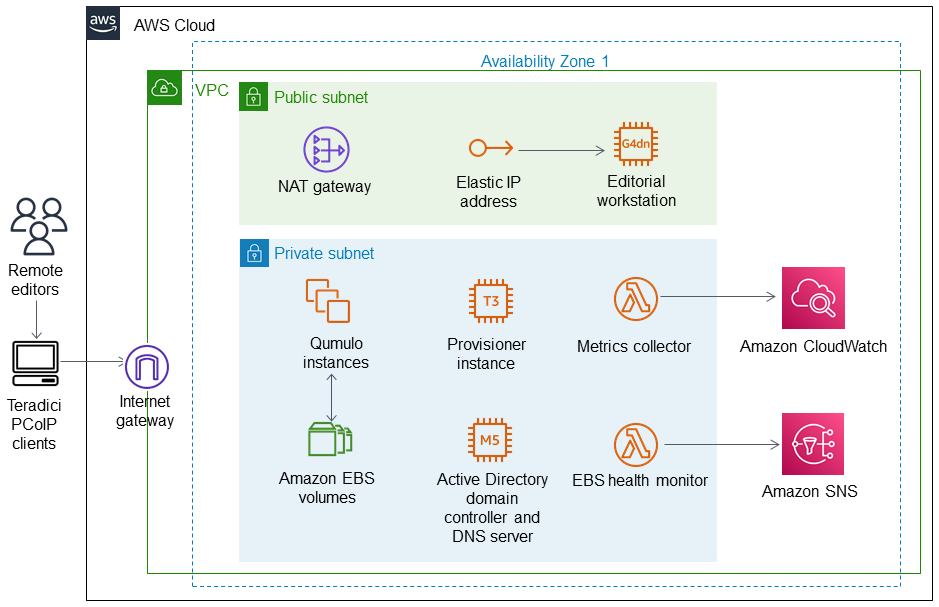

Deploying this Quick Start for a new virtual private cloud (VPC) builds the following {partner-product-short-name} environment in the
AWS Cloud.

// Replace this example diagram with your own. Send us your source PowerPoint file. Be sure to follow our guidelines here : http://(we should include these points on our contributors giude)
:xrefstyle: short
[#architecture1]
.Quick Start architecture for {partner-product-short-name} on AWS

As shown in <<architecture1>>, the Quick Start sets up the following:

* A VPC configured with public and private subnets, according to AWS best practices, to provide you with your own virtual network on AWS.*
* An internet gateway to allow communication between the VPC and the internet.* 
* In the public subnet:
** A managed network address translation (NAT) gateway to allow outbound internet access for resources in the private subnet.*
** An Elastic IP address to allow the Amazon EC2 instance to communicate with the internet.  
** One or more editorial workstations hosted on an EC2 G4dn instance running Windows Server 2019. The server is accessed via Teradici PCoIP and configured with Adobe Premiere Pro with a pop-up per-boot cycle for logging in to Adobe Creative Cloud.
* In the private subnet:
** A cluster of four Qumulo Core EC2 instances providing 1 or 12-TB of usable capacity.
** Multiple Amazon Elastic Block Store (Amazon EBS) volumes connected to the Qumulo cluster. Options include:
*** 1-TB usable capacity option contains 24 of 100 GiB Amazon EBS General Purpose SSD (gp2) volumes.
*** 12-TB usable capacity option contains 20 of 100 GiB Amazon EBS gp2 volumes and 40 of 500 GiB EBS Throughput Optimized HDD (st1) volumes.
** An EC2 T3 provisioner instance that is removed after provisioning Qumulo. This instance performs the following: 
*** Creates Qumulo cluster users, roles, IP failover, and a Server Message Block (SMB) file share.
*** Joins the cluster to the Active Directory domain.
*** Tags all Amazon EBS volumes with the CloudFormation stack name and modifies the AWS Key Management Service (AWS KMS) customer master key (CMK) policy if a CMK is specified in the template.
** An Active Directory domain controller and local DNS server hosted on an EC2 M5 (m5.large) instance. All workstations and the Qumulo cluster are joined to the Active Directory domain automatically. The Active Directory server also provides all DNS services local to the VPC while forwarding public requests to Amazon Route 53.
** A Lambda function to collect metrics from the Qumulo cluster and send them to Amazon CloudWatch.
** A Lambda function to monitor the health of Amazon EBS volumes, automatically replace unhealthy volumes, and deliver SNS notifications via Amazon SNS.

[.small]#*The template that deploys the Quick Start into an existing VPC skips the components marked by asterisks and prompts you for your existing VPC configuration.#
