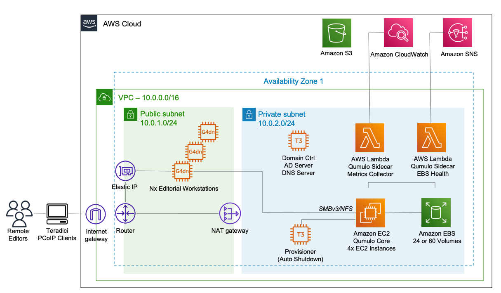

Deploying this Quick Start for a new virtual private cloud (VPC) builds the following {partner-product-short-name} environment in the
AWS Cloud.

// Replace this example diagram with your own. Send us your source PowerPoint file. Be sure to follow our guidelines here : http://(we should include these points on our contributors giude)
:xrefstyle: short
[#architecture1]
.Quick Start architecture for {partner-product-short-name} on AWS

As shown in <<aws-quickstart-graphic>>, the Quick Start sets up the following:

* A virtual private cloud (VPC) configured with public and private subnets, according to AWS
best practices, to provide you with your own virtual network on AWS.*
* In the public subnet:
** A managed network address translation (NAT) gateway to allow outbound.
internet access for resources in the private subnet.*
** One or more EC2 g4dn instances running Windows Server 2019.
*** Teradici PCoIP is installed for streaming the editorial workspace to remote editors.
*** Windows is configured in an optimized fashion for Adobe Premiere Pro with a pop-up per boot cycle for Adobe Creative Cloud login.
* In the private subnet:
** A cluster of four Qumulo EC2 instances providing 1TB or 12TB of usable capacity.
** Multiple Amazon Elastic Block Store (EBS) volumes connected to the Qumulo cluster.
*** 1TB usable capacity: 24x 100GiB EBS gp2 volumes.
*** 12TB usable capacity: 20x 100GiB EBS gp2 volumes and 40x 500GiB EBS st1 volumes.
** Two Lambda functions to monitor and report on the Qumulo environment.
*** One Lambda function sends metrics for the Qumulo cluster to CloudWatch.
*** The other Lambda function monitors the health of EBS volumes and autmatically replaces any unhealthy volumes.
** An EC2 t3.large instance acting as an Active Directory domain controller and local DNS server.
*** All workstations and the Qumulo cluster are joined to the AD domain automatically.
*** The AD server also provides all DNS services local to the VPC forwarding public requests to Route53.
** A temporary provisioner instance that performs the following:
*** Creates Qumulo cluster users, roles, IP failover, and an SMB share.
*** Joins the cluster to the AD domain.
*** Tags all EBS volumes with the CloudFormation stack name and modifies the KMS Customer Managed Key (CMK) policy if a CMK is specified in the template.
// Add bullet points for any additional components that are included in the deployment. Make sure that the additional components are also represented in the architecture diagram. End each bullet with a period.

[.small]#*The template that deploys the Quick Start into an existing VPC skips the components marked by asterisks and prompts you for your existing VPC configuration.#
