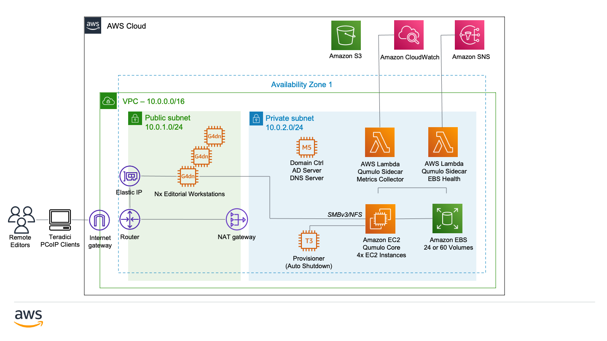

Deploying this Quick Start for a new virtual private cloud (VPC) with
default parameters builds the following {partner-product-short-name} environment in the
AWS Cloud.

// Replace this example diagram with your own. Send us your source PowerPoint file. Be sure to follow our guidelines here : http://(we should include these points on our contributors giude)
:xrefstyle: short
[#architecture1]
.Quick Start architecture for {partner-product-short-name} on AWS

As shown in <<architecture1>>, the Quick Start sets up the following:

* A VPC configured with public and private subnets, according to AWS
best practices, to provide you with your own virtual network on AWS.*
* In the public subnet:
** A managed network address translation (NAT) gateway to allow outbound
internet access for resources in the private subnet.*
** A network load balancer to divide network traffic among the Qumulo cluster nodes.
* In the private subnets:
** A cluster of four Qumulo EC2 instances.
** An Amazon Elastic Block Store (EBS) shared drive.
** Lambda functions to monitor and report on the Qumulo environment.
** An EC2 instance acting as an Active Directory domain controller.
** One or more EC2 instances running Teradici for streaming editorial workspace environments via PCoIP.
// Add bullet points for any additional components that are included in the deployment. Make sure that the additional components are also represented in the architecture diagram. End each bullet with a period.

[.small]#*The template that deploys the Quick Start into an existing VPC skips the components marked by asterisks and prompts you for your existing VPC configuration.#
