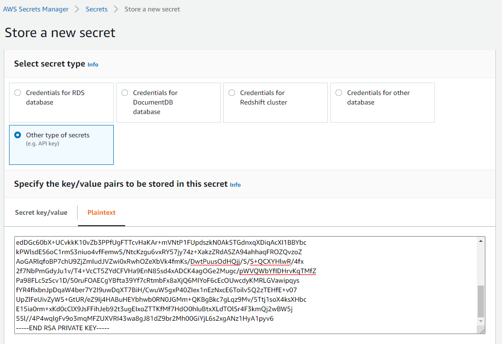

// If no preperation is required, remove all content from here

==== Prepare for the deployment

The Studio Q deployment requires the EC2 private key .PEM file to be stored in Secrets Manager:

1. Navigate to https://console.aws.amazon.com/secretsmanager/home[AWS Secrets Manager]
2. Select *Store a new secret*
3. Select *Other type of secrets*
4. Select *Plaintext*
5. Paste the content of the .PEM file into the box
6. Save the secret

[#prereqs1]
.PEM file stored in AWS Secrets Manager

